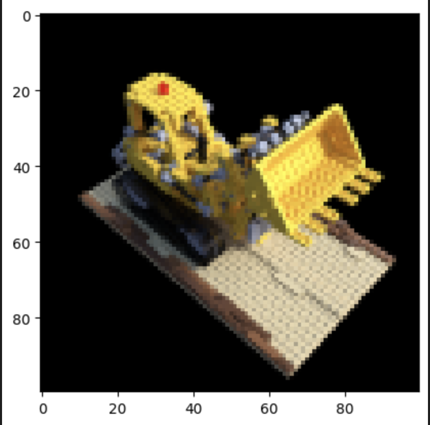
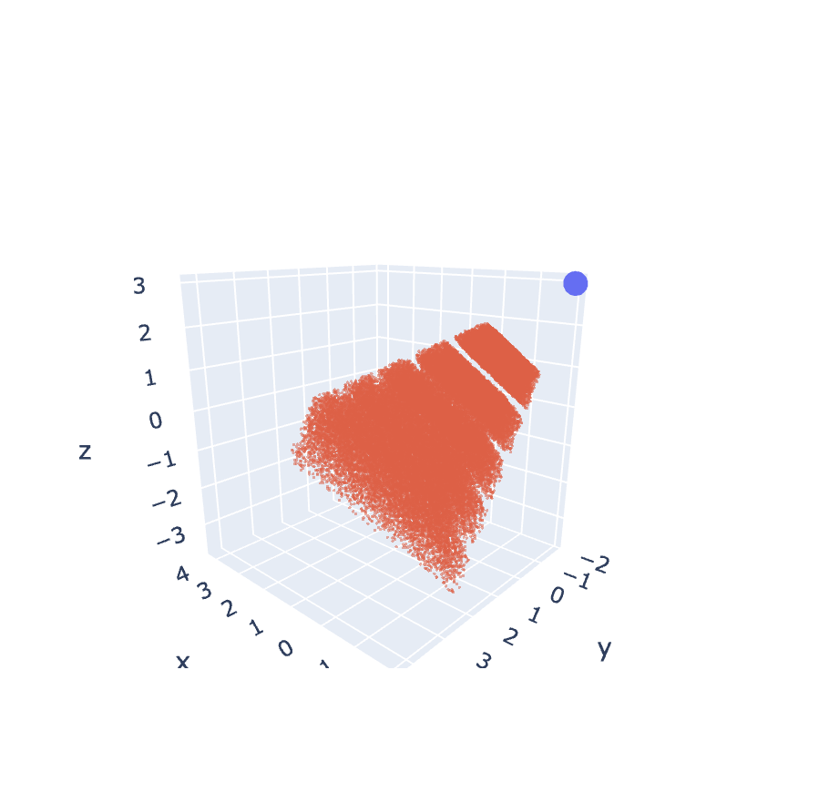
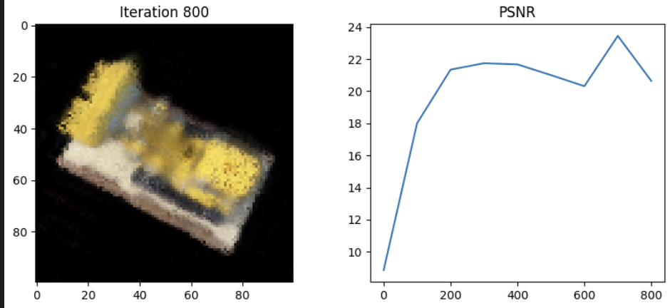

# Tiny_Nerf 
This is a PyTorch implementation of tiny NeRF (Neural Radiance Field). The original paper is [NeRF: Representing Scenes as Neural Radiance Fields for View Synthesis](https://arxiv.org/abs/2003.08934). This version is a much smaller version of the original model, which you can simply train even on your cpu(!) in a reasonable time.

## Requirements and Setup
First, please make a new environment and install the requirements.
```
python3 -m venv env
source env/bin/activate
```
or
```
conda create -n tiny-nerf python=3.10
conda activate tiny-nerf
```
Then, install the requirements.
```
pip install -r requirements.txt
```

## Dataset
Currently, we use the simple toy car from the main Blender Dataset. More data loading and processing will be added soon.
(The code for downloading the toy dataset is implemented in the notebook)

## Visualizations
There are multiple visualizations in the notebook to make you understand the model better. Here are some of them:

- The toy dataset:
  

- Visualizing the querying process and the poses:
  

## Tensorboard support
You can use the train and test functions with argument `use_tensorboard=True` to use tensorboard. The tensorboard logs will be saved in `logs/` folder.

```
# For training
model = create_and_train_model(use_tensorboard=False)

# For testing
evaluate_model(model, test_images, test_poses, use_tensorboard=False)
```

or you can see the results as images in the notebook itself (default value for this argument is `False`). The results will look like this:



## Different Sections
The notebook is divided into different sections and are titled accordingly. Please note that as it's a simple version of the original NeRF model, these options are *not* included:

1. 5D Input including view directions
2. Hierarchical sampling
   
## Contact
If you have any questions, or you need any new features implemented, please feel free to open a new issue or contact me with [my email](mailto:arazlghi@gmail.com).
